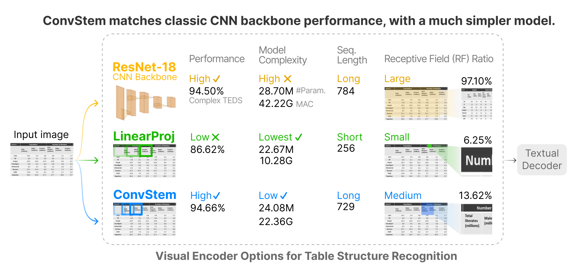

# High-Performance Transformers for Table Structure Recognition Need Early Convolutions

[](https://arxiv.org/abs/2311.05565)
[](https://github.com/poloclub/wizmap/blob/main/LICENSE)

This is a PyTorch implementation of the NeurIPS'23 TRL Workshop Oral paper [High-Performance Transformers for Table Structure Recognition Need Early Convolutions](https://arxiv.org/abs/2311.05565).


- [x] <a href="https://arxiv.org/abs/2311.05565">Research Paper 📖</a>
- [x] <a href="https://shengyun-peng.github.io/tsr-convstem">Project Page 🚀</a>

<p align="center">
    
</p>

## News
`Oct. 2023` - Paper accepted by [NeurIPS'23 2nd Table Representation Learning Workshop](https://table-representation-learning.github.io/)

`Oct. 2023` - Paper selected as [oral](https://openreview.net/group?id=NeurIPS.cc/2023/Workshop/TRL)

## Get Started
1. Prepare PubTabNet dataset available [here](https://github.com/ibm-aur-nlp/PubTabNet/tree/master#getting-data)
2. Change the "pubtabnet_dir" in [Makefile](./Makefile) to "your path to PubTabNet"
3. Set up venv
```bash
make .venv_done
```

## Training, Testing & Evaluation
1. Train an instance of visual encoder with ResNet-18
```bash
make experiments/r18_e2_d4_adamw/.done_train_structure
```
2. Test + Compute teds score
```bash
make experiments/r18_e2_d4_adamw/.done_teds_structure
```
3. All models in ablations are defined in "Experiment Configurations" section of [Makefile](./Makefile). Replace "r18_e2_d4_adamw" with any other configuration for training and testing.

## Citation
```bibtex
@inproceedings{peng2023high,
  title={High-Performance Transformers for Table Structure Recognition Need Early Convolutions},
  author={Peng, Anthony and Lee, Seongmin and Wang, Xiaojing and Balasubramaniyan, Rajarajeswari Raji and Chau, Duen Horng},
  booktitle={NeurIPS 2023 Second Table Representation Learning Workshop},
  year={2023}
}
```
## Contact
If you have any questions, feel free to [open an issue](https://github.com/poloclub/tsr-convstem/issues/new) or contact [Anthony Peng](https://shengyun-peng.github.io/) (CS PhD @Georgia Tech).